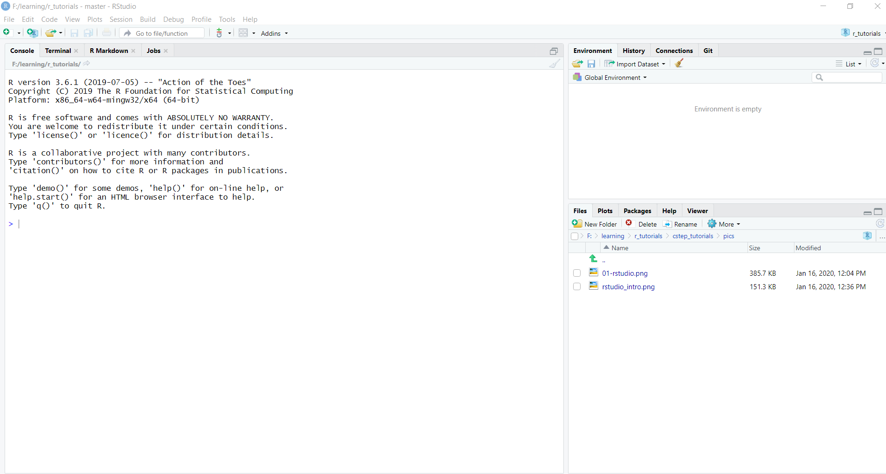
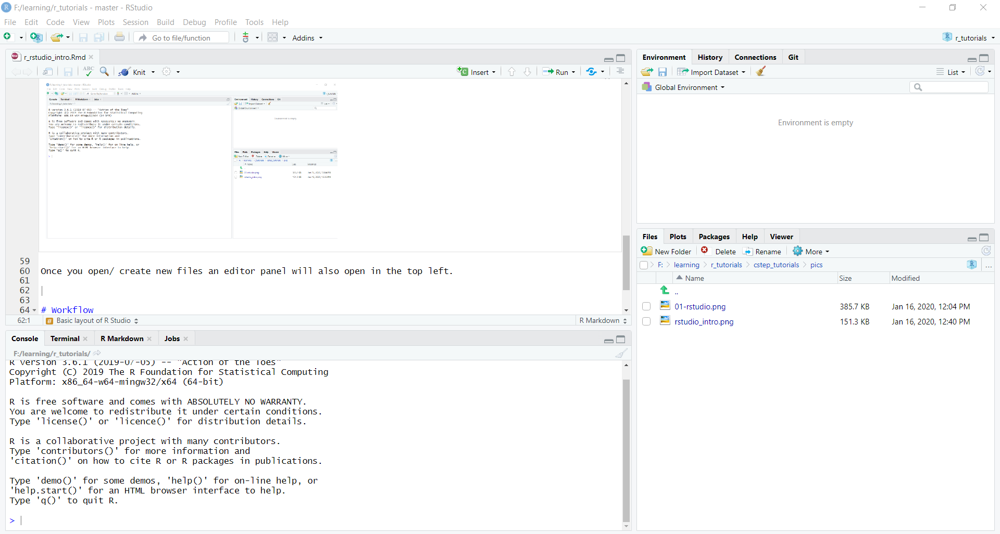
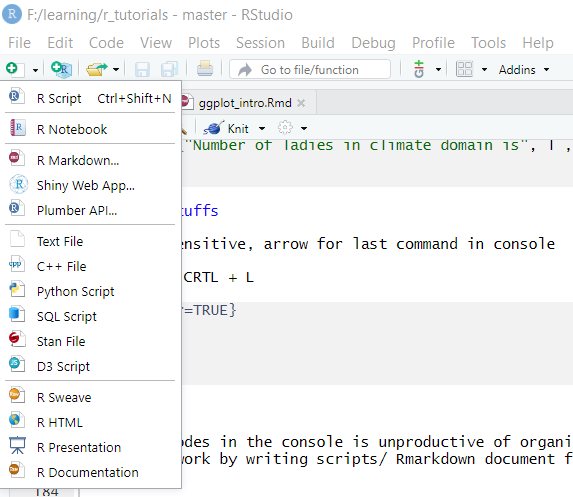
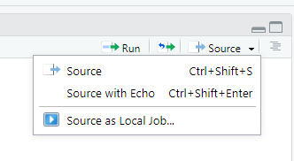
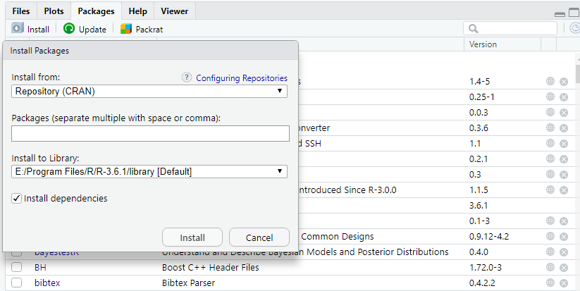
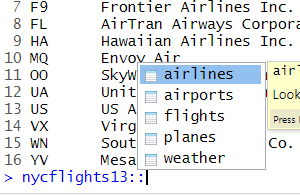

```{r setup, include=FALSE}
knitr::opts_chunk$set(echo = TRUE)
library(here)
```

# Setup

This series of tutorials assumes you have R and R Studio are installed on your computer.

The latest versions of R for can be downloaded from [here](https://cran.r-project.org/). If you are using Windows, download the _Binaries for base distribution_ from [here](https://cran.r-project.org/bin/windows/base/R-3.6.2-win.exe)

The latest version of RStudio for can be downloaded from [here](https://rstudio.com/products/rstudio/download/). Opt for _Free_ version of RStudio Desktop.

Install both R and RStudio. If you have 64 bit machine opt for 64 bit version of R.


## Getting Started

Let'start !!

Throughout this lesson, we’re going to learn some of the fundamentals of the R language as well as some best practices for organizing code for scientific projects that will make your life easier.

Our focus would be to:

* Learn how to make publication quality figures effeciently using ggplot2
* Learn how to transfrom a dataset using dplyr
* Learn how to wrangle data using readr, tidyr, dplyr, stringr, lubridate, forcats
* Use R as a programming language
* Build regression models 
* Effectively communicate results via Rmardown
* Version control using git/ GitHub and RStudio

We shall be using RStudio for this tutorial which a free, open source R integrated development environment. It provides a built in editor, works on all platforms (including on servers) and provides many advantages such as integration with version control and project management. 

## Basic layout of R Studio

When you first open RStudio, you will be greeted by three panels:

The interactive R console (entire left)
Environment/History (tabbed in upper right)
Files/Plots/Packages/Help/Viewer (tabbed in lower right)



Once you open/ create new files an editor panel will also open in the top left.




# Workflow

* Instruct RStudio not to preserve your workspace between sessions
* ```getwd()``` and ```setwd()```
* Paths and directories
* Create a new project
* Seeking Help

# Introduction to R

## Using R as a calculator

```{r}
159 + 34 * 7 / 5
(159 + 34 * 7) / 5
(159 + 34 * 7) / 5 # this is a comment
1 / 10000 
2e3 * 3e2

5 ^ 2; 6 ** 5 # power

25 / 100 # division
125 %/% 100 # Integer divide 
30 %% 7 # Reminder
```

## Mathematical fucntions

```{r}
sin(pi / 2) # trigonometry function
log(10) # logarithm base 10
log(10, base = 10) # logarithm base 10
log2(10) # logarithm base 2
exp(10) # e^10
```


## Comparing things

```{r}
10 < 4
1 == 3
1 != 7
25 > -8
```


## Variables and assignment

```{r, error = TRUE}
x <- 5 * 40 + 120
x
x <- 500
x

y <- 300

x+y

a <- "I am"
b <- "foolish"
a + b

paste(a, b)

```

The right hand side of the assignment can be any valid R expression. The right hand side is fully evaluated before the assignment occurs.

Variable names can contain letters, numbers, `_` and `.` . They cannot start with a number nor contain spaces at all. Different people use different conventions for long variable names, these include

* i_use_snake_case
* otherPeopleUseCamelCase
* some.people.use.periods
* And_aFew.People_RENOUNCEconvention

What you use is up to you, but be consistent.

It is also possible to use the = operator for assignment

```{r}
x = 5 * 40 + 120
x
x = 500
x
```

## Missing value

Missing data is denoted by `NA` in R

```{r}

x <- c("a", NA, "c", "d", NA)
y <- c("a", "b", "c", "d", "e")
z <- c(1:5, NA, NA)
is.na(x)
is.na(y)
mean(z)
mean(z, na.rm = TRUE) # Exclude missing value from analysis
```


## Other Stuffs

* R is case sensitive, 
* Up arrow for last command in console
* CRTL + L to clear console


```{r, error=TRUE}
x <- 250
X
rm(x)
rm(list = ls(all.names = TRUE)) # removes all environment variable

```

## R objects and Data Structures

### R Objects

Major data types: `double`, `integer`, `complex`, `logical`, `character`.

```{r}

typeof(1) # double
typeof(20L) # integer
typeof(5 + 3i) # complex
typeof(c('cstep', 'ceew', 'irade', 'teri'))
typeof(c(FALSE, TRUE))
typeof(1==9)
```

### R Data Structures

#### Atomic Vectors

```{r}
1:5
6^(1:5)
5 * (1:5)
my_vec <- c(1:5, c(4:8))
typeof(my_vec)
length(my_vec)
is.integer(my_vec)
is.character(my_vec)
my_vec_multi <- 2 * my_vec; my_vec_multi

seq(5)
seq(1, 5)
seq(1, 10, length.out = 5)
seq(1, 10, by = 3)

ladies <- c('Roshna', 'Shweta', 'Riya', 'Ilika', 'Krittika')
gents <- c('Nikhilesh', 'Partha')

l <- length(ladies); g <- length(gents)

print(paste("Number of ladies in climate domain is", l , 'which is approximately', l/g, 'times more than gents\' number', g))

typeof(ladies)

ladies[3]
ladies[c(1,5)]

cstep_exp <- c(3, 5, 5, 1.5, .8)
names(cstep_exp) <- ladies

cstep_exp['Roshna']

```

## Matrices

```{r}

m <- matrix(1:6, nrow = 3, ncol = 2); m
m <- matrix(1:6, nrow = 3, ncol = 2, byrow = TRUE); m


n <- matrix(c(1:10), nrow = 2, ncol = 5, dimnames = list(gents, ladies)) ; n

n <- matrix(c(1:10), nrow = 2, ncol = 5); n

m[3,]; n[1,]

m %*% n
```

## Factors


```{r}
as.factor(c('cstep', 'ceew', 'irade', 'teri', 'teri', 'ceew'))
as.factor(c(1, 4, 5, 10, 2, 3, 1, 5, 10))

fac <- c(rep('a', 3), rep('c', 2), rep('r', 7))
fac
fac_tor <- factor(fac)
fac_tor
```


## Data frames

```{r}
age <- c(31, 30, 29, NA)
name <- c("Riya", "Krittika", "Ilika", 'Roshna')
exp <- c(5, .8, 1.5, 3)
mydata <- data.frame(name, age, exp)
names(mydata) <- c("age", "researcher", "experience") # variable names
mydata
str(mydata)

mydata[1:2]
mydata['age']
mydata$researcher

head(mydata)
tail(mydata)
head(mydata, n =2)

```


# R Scripts

* Writing codes in the console is unproductive of organizing work
* Organize work by writing scripts/ Rmarkdown document for a specific purpose
* Run the whole script by `sourcing` it using `CRTL` + `Shift` + `S`. Alternatevely run selective lines(s) by `CRTL` + `return`

  

# R Packages

R packages extend the functionality of core/ base R by providing additional functions, data, and documentation. They are written by a worldwide community of R users and can be downloaded for free from the internet. Most of the R package is availabe through [`CRAN`](https://cran.r-project.org/). Development version of some packages can also be installed from `GitHub` repositories. 


## Installing and using R Package

## Installing

### From Console

```{r, eval=FALSE}

install.packages(dplyr)
install.packages(c('dplyr', 'ggplot', 'tidyr'))
```

### From RStudio



We shall be focusing on [tidyverse](https://www.tidyverse.org/) which is a collection of R packages designed for data science by [Hadley Wickham](http://hadley.nz/).

```{r eval=FALSE}
install.packages(tidyverse)
```

```{r}
library(tidyverse)
```

## Using a Package

Before using a package it needs to be loaded in the present R Session

```{r}
library(tidyverse)
```

* In a R script always initialize the libraries first
* Particular function of a package can also be used at runtime by explicitly specifying the package name and function 
```{r, eval=FALSE}
dplyr::mutate()
ggplot2::geom_col()
```

# Explore a dataset

## The `nycflights13` package: install and initialize

We shall explore `nycflights13` package which contains airline on-time data for all flights departing NYC
in 2013

```{r, eval=FALSE}
install.packages('nycflights13')
```

```{r}
library(nycflights13)
```

## Datasets in `nycflights13`



* flights: Information on all 336,776 flights.
* airlines: A table matching airline names and their two-letter International Air Transport Association (IATA) airline codes (also known as carrier codes) for 16 airline companies. For example, “DL” is the two-letter code for Delta.
* planes: Information about each of the 3,322 physical aircraft used.
* weather: Hourly meteorological data for each of the three NYC airports.
  possible hourly measurements one can observe at three locations over the course of a year.
* airports: Names, codes, and locations of the 1,458 domestic destinations.

## `flights` data frame

```{r}
flights
```

## Exploring data frames

1. Using the View() function, which brings up RStudio’s built-in data viewer.
2. Using the glimpse() function, which is included in the dplyr package.
3. Using the kable() function, which is included in the knitr package.
4. Using the $ “extraction operator,” which is used to view a single variable/column in a data frame

### View
```{r}

View(flights)
```

### glimpse


```{r}
dplyr::glimpse(flights)
```

### kable

```{r}
knitr::kable(head(flights))
```

### `$` Operator

```{r}
airlines$carrier
```

